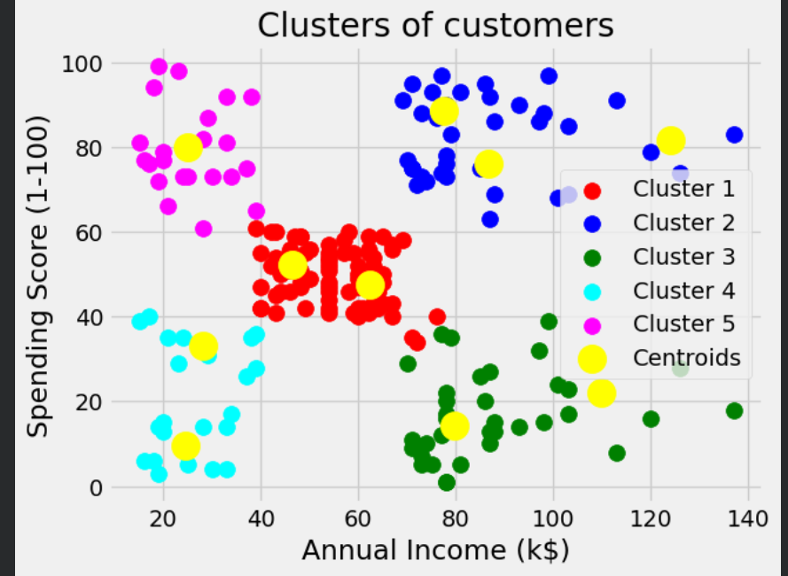
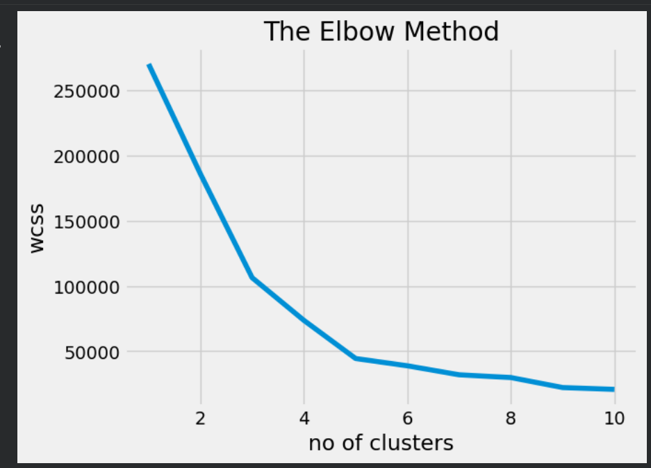
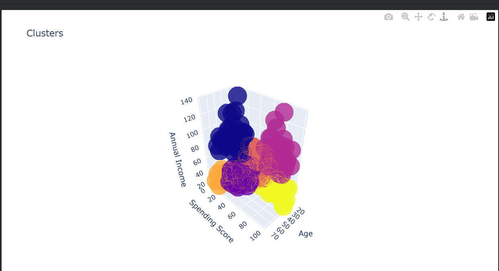
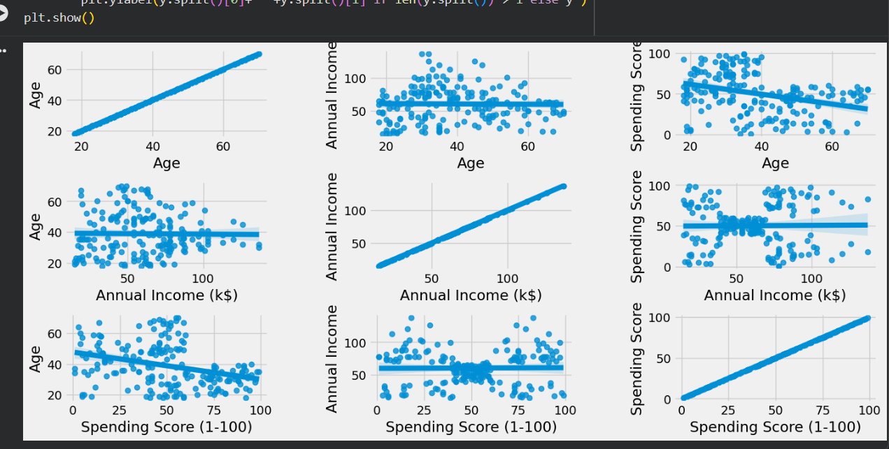

# Customer-Segmentation-KMeans
Customer segmentation using K-Means clustering

## 📌 Project Description
This project performs customer segmentation using the K-Means clustering algorithm.
It groups customers based on their age, annual income, and spending score to help
businesses understand customer behavior and target marketing strategies effectively.

## 🛠 Technologies Used
- Python
- Pandas
- NumPy
- Matplotlib
- Seaborn
- Scikit-learn

## 📂 Dataset
The dataset used is **Mall_Customers.csv**, which contains customer details such as:
- Customer ID
- Age
- Annual Income
- Spending Score

## ⚙️ Steps Performed
1. Data loading and preprocessing
2. Exploratory Data Analysis (EDA)
3. Elbow method to find optimal clusters
4. K-Means clustering
5. Visualization of customer segments

## 📸 Output Screenshots

### Dataset Preview

### Elbow Method

### Customer Clusters

### Additional Visualization

## ✅ Conclusion
The project successfully segments customers into different groups using K-Means,
which can be used for business decision-making and targeted marketing.
